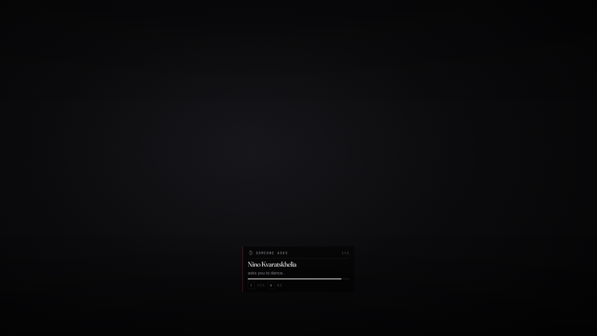

# lxr-love — Paired interactions by consent, for LXRCore

One asks, the other sees a card and says yes or no, and only then do both
peds play. Hugs, a kiss on the cheek, a dance, a slap, and a proposal with
a ring from the satchel. The server keeps the asking, the answering, the
cooldowns and the pairing.



> **Disclaimer.** This resource ships casual interactions only. An adult
> animation set exists as a switch (`Config.Adult.enabled`) that is **off**
> by default and **empty** by default: nothing of that kind is included
> here. A server operator who turns it on and fills it does so knowingly,
> is solely responsible for it, for their players' age verification, and
> for the rules of the platforms and jurisdictions they run under. Consent
> cards cannot be bypassed by configuration; adult entries always require
> consent even if their config says otherwise.

## What it does

* **Options on a person** through lxr-interact: hug, kiss on the cheek,
  ask for a dance, propose, slap.
* **Consent** — a card on the LXR UI Kit with a countdown; **Y** / **N**.
  The slap is the one interaction that does not ask (`consent = false`).
* **Pairing** — the answerer is placed at the asker's `offset`; both play
  their side for `seconds`; `Player(src).state.loving` while paired.
* **Proposal** — takes a ring (`ring_gold`, `ring_silver`, `ring_wedding`)
  from the asker and hands it to the other on yes; writes each other's
  citizenid into core metadata `partner` (`Config.Rules.partnerMetadata`).
* **Animations** — `Config.Interactions[*].a / b = { dict, anim }`. The
  names shipped are **not verified against the game**: a dictionary that
  does not load is reported to both players and the moment ends. Replace
  them with names from your build.
* **Events** — `lxr:love:played (a, b, id, item)`, `lxr:love:declined`.

## Install

```cfg
ensure lxr-core
ensure lxr-interact
ensure lxr-love
```

## API

| Name | Side | Purpose |
|---|---|---|
| `IsPaired(src)` | server | is this player mid-interaction |
| `IsPaired()` | client | local mirror |

## Licence

© 2026 iBoss21 / LXRCore — All Rights Reserved. See `LICENSE`.
